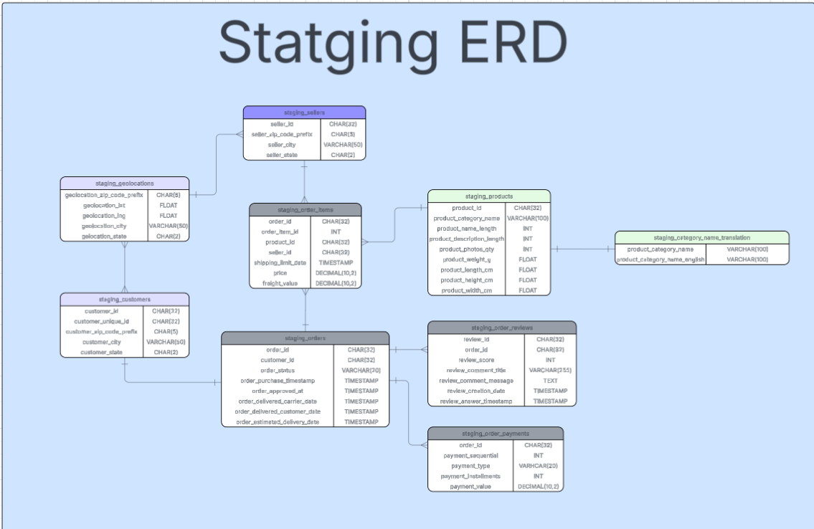
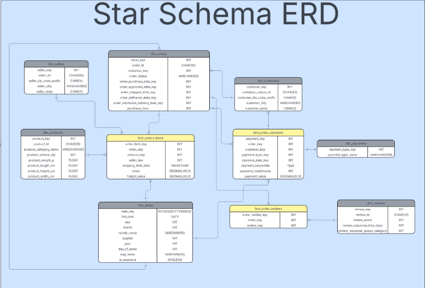
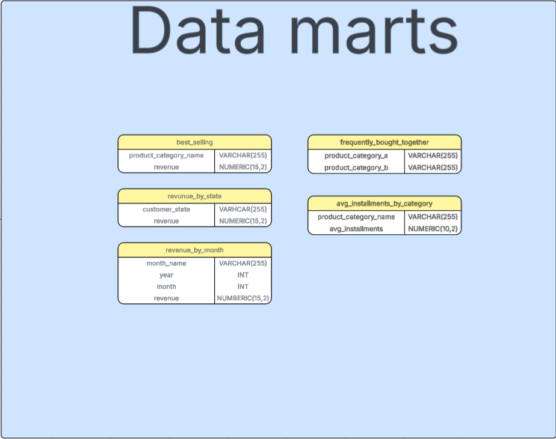
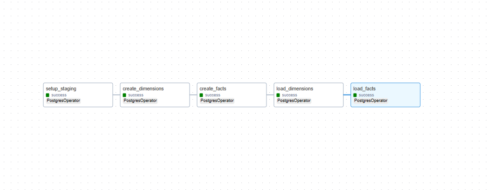
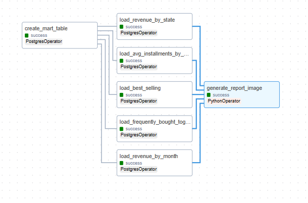
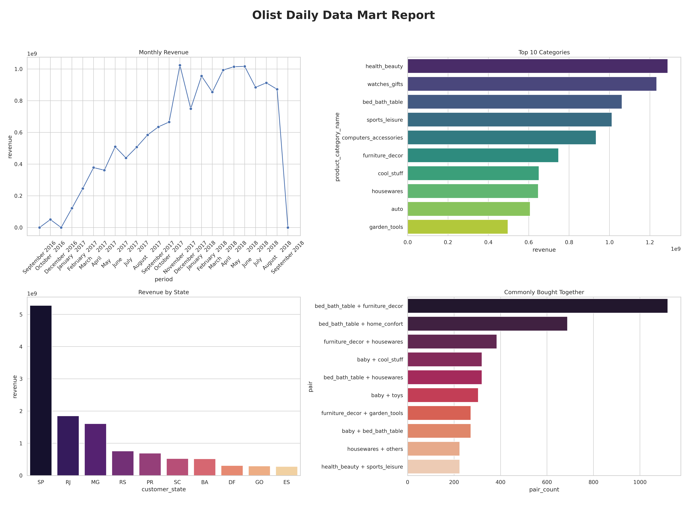

# 🛒 Olist E-commerce Data Warehouse Architecture

[](https://airflow.apache.org/)
[](https://www.postgresql.org/)
[](https://www.docker.com/)
[](https://matplotlib.org/)

This project demonstrates the design and implementation of an **End-to-End Data Pipeline** for the Olist E-commerce dataset (Brazil). The architecture transforms fragmented, transactional (OLTP) staging data into a high-performance analytical (OLAP) environment utilizing a **Star Schema** structure.


## 🏗️ System Architecture
The pipeline follows the **Medallion Architecture** principles, organized into three distinct layers:

1.  **Staging Area (Bronze):** Ingestion of raw CSV datasets directly into PostgreSQL.
   
2.  **Data Warehouse (Silver):** Data transformation into a **Star Schema** to optimize query performance:
    * **Fact Tables:** `fact_order_items`, `fact_order_payments`, `fact_order_reviews`
    * **Dimension Tables:** `dim_products`, `dim_customers`, `dim_orders`, `dim_dates`, `dim_payments`, `dim_reviews`, `dim_sellers`
    
3.  **Data Marts (Gold):** Creation of aggregated tables tailored for business intelligence, such as monthly revenue, top-selling products, and Market Basket Analysis.
   

## ⚙️ Data Pipeline Workflow
The pipeline is orchestrated by **Apache Airflow**, ensuring a modular and resilient ETL process. It is divided into four main stages:

### 1. Data Ingestion (Staging) and Transformation (Star Schema - Silver Layer)
* **Source:** Raw CSV files from the Olist Kaggle dataset.
* **Process:** Loads raw data into the `staging` schema in PostgreSQL.
* **Tool:** `PostgresOperator` executing SQL COPY commands.
* **Process:** Cleanses and transforms staging data into a **Star Schema** to minimize redundancy and optimize for analytical queries.
* **Tasks:**
    * Populating **Dimension Tables** (`dim_products`, `dim_customers`, etc.)
    * Populating **Fact Tables** (`fact_order_items`, `fact_order_payments`,`fact_order_reviews`) using surrogate keys.
  

### 2. Aggregation (Data Marts - Gold Layer) And Automated Reporting (Visualization)
* **Process:** Executes complex SQL aggregations to create specialized tables (Data Marts) for business use cases.
* **Output Tables:** `revenue_by_month`, `best_selling`, `frequently_bought_together`.
* **Benefit:** Eliminates the need for expensive JOINs at the reporting layer.
* **Process:** A `PythonOperator` triggers a custom script using **Matplotlib** and **Seaborn**.
* **Output:** Generates a high-resolution PNG report (`daily_report.png`) capturing key business metrics.


## 🛠️ Tech Stack & Optimization
* **Orchestration:** Apache Airflow for pipeline management and workflow scheduling.
* **Storage:** PostgreSQL 15 deployed via Docker Containers.
* **Visualization:** * *Initial:* Interactive Streamlit Dashboard for exploratory analysis.
    * *Optimized:* **Matplotlib & Seaborn Static Reporting** for maximum performance and minimal resource overhead.
* **Key Performance Optimizations:**
    * **Data Marting:** Pre-aggregating data to eliminate heavy JOIN operations at the dashboard level.
    * **Docker Shared Memory Tuning:** Configured `shm_size` to handle high-volume data processing and prevent memory-related crashes (e.g., DiskFull errors).
    * **Automated Reporting:** Implemented an Airflow `PythonOperator` to automatically generate visual reports as PNG files immediately after the ETL process completes.

## 📊 Key Insights Generated
The system provides automated answers to critical business questions:
* **Revenue Analysis:** Tracking monthly revenue trends and growth.
* **Product Performance:** Identifying the top 10 most profitable product categories.
* **Logistics & Geography:** Mapping orders by state to identify high-density markets.
* **Market Basket Analysis:** Identifying frequently bought together products to support cross-selling strategies.
  


## 🚀 Getting Started
1.  **Clone the repository:**
    ```bash
    git clone [https://github.com/MasTerKey1121/Olist-E-commerce-Data-Warehouse-Architecture.git](https://github.com/MasTerKey1121/Olist-E-commerce-Data-Warehouse-Architecture.git)
    ```
2.  **Initialize Infrastructure:**
    ```bash
    docker-compose up -d
    ```
3.  **Execute Pipeline:**
    Access the Airflow UI at `localhost:8080` and trigger the `olist_datamart_pipeline_v1` DAG.
4.  **View Automated Report:**
    Upon completion, the visual report is automatically saved to `/logs/daily_report.png`.

---

## 👨‍💻 Author
**MasterKey11** - Banchpol Bubphamala
* **Email:** banchpolch11@gmail.com
* **GitHub:** [MasTerKey1121](https://github.com/MasTerKey1121)
* **All Schema:** [LucidChart](https://lucid.app/lucidchart/a3fa2fe3-54b6-4560-9b0a-29bc12bad1b6/edit?viewport_loc=3360%2C-1024%2C3680%2C1743%2C0_0&invitationId=inv_bef9b3c7-92fc-4aa1-b97f-64556b93a575)
## DATASET
* **Kaggle:** [Brazilian E-Commerce Public Dataset by Olist](https://www.kaggle.com/datasets/olistbr/brazilian-ecommerce)
---

